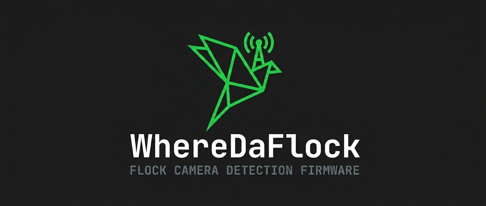

<p align="center">
  
</p>

<p align="center">
  <strong>An Open-Source 2.4GHz RF Surveillance Countermeasure & Privacy-Preserving Navigation Ecosystem</strong>
</p>

<p align="center">
  <em>Defending spatial privacy through passive RF detection, on-device machine learning, and surveillance-aware routing.</em>
</p>

<p align="center">
  <a href="https://github.com/xanstomper/WhereDaFlock/blob/main/LICENSE"></a>
  <a href="https://swift.org"></a>
  <a href="https://developer.apple.com/ios/"></a>
  <a href="https://www.espressif.com/"></a>
  <a href="https://platformio.org/"></a>
  <a href="#"></a>
  <a href="#"></a>
</p>

<p align="center">
  <a href="#1-system-overview--threat-landscape">System Overview</a> •
  <a href="#2-flock-safety-cameras-complete-architecture-tech-stack--framework">Flock Camera Teardown</a> •
  <a href="#3-wheredaflock-firmware-architecture-firmware">Firmware Engine</a> •
  <a href="#4-wheredaflock-ios-application-architecture-wheredaflock">iOS App</a> •
  <a href="#5-hardware-assembly--firmware-flashing-guide">Hardware & Flashing</a> •
  <a href="#6-empirical-datasets--ieee-oui-database-datasets">Datasets</a>
</p>

---

## 📑 Table of Contents

1. [System Overview & Threat Landscape](#1-system-overview--threat-landscape)
2. [Flock Safety Cameras: Complete Architecture, Tech Stack & Framework](#2-flock-safety-cameras-complete-architecture-tech-stack--framework)
   - [Physical & Hardware Teardown](#physical--hardware-teardown)
   - [Edge Compute, OS & Power Management](#edge-compute-os--power-management)
   - [Optical Pipeline & Computer Vision Edge Inference](#optical-pipeline--computer-vision-edge-inference)
   - [RF Signatures & The Evolution of 2.4GHz WiFi Probes](#rf-signatures--the-evolution-of-24ghz-wifi-probes)
   - [Cloud Ecosystem, Hotlists & Law Enforcement Integration](#cloud-ecosystem-hotlists--law-enforcement-integration)
3. [WhereDaFlock Firmware Architecture (`firmware/`)](#3-wheredaflock-firmware-architecture-firmware)
   - [Hardware Specification & Pinout](#hardware-specification--pinout)
   - [Receive-Only Promiscuous 802.11 Sniffer](#receive-only-promiscuous-80211-sniffer)
   - [Descending Channel Hopping Strategy](#descending-channel-hopping-strategy)
   - [802.11 Frame Parsing & Information Element (IE) Engine](#80211-frame-parsing--information-element-ie-engine)
   - [The 5 Confidence Tiers](#the-5-confidence-tiers)
   - [OUI Registry & The Locally Administered MAC Bit](#oui-registry--the-locally-administered-mac-bit)
   - [Concurrency, Ring Buffer & Deduplication](#concurrency-ring-buffer--deduplication)
   - [On-Device Session Persistence & NVS Audio Muting](#on-device-session-persistence--nvs-audio-muting-srcsessionh)
   - [Hardware Display Driver](#hardware-display-driver-srcdisplay_dongleh-display_donglecpp)
   - [Auditory & Serial Output Protocol](#auditory--serial-output-protocol)
   - [Python Host Companion](#python-host-companion-host_scannerpy)
4. [WhereDaFlock iOS Application Architecture (`WhereDaFlock/`)](#4-wheredaflock-ios-application-architecture-wheredaflock)
   - [Architecture & Technology Stack](#architecture--technology-stack)
   - [Live Intelligence Map & Spatial Clustering](#live-intelligence-map--spatial-clustering)
   - [AI Navigation & Privacy-Scored Routing](#ai-navigation--privacy-scored-routing)
   - [Multi-Modal Scanner Suite (Vision, BLE, Telemetry)](#multi-modal-scanner-suite-vision-ble-telemetry)
   - [Zero-Knowledge Privacy Engine & Cryptography](#zero-knowledge-privacy-engine--cryptography)
   - [Community Reporting & Confidence Decay](#community-reporting--confidence-decay)
5. [Backend Infrastructure & Web Dashboard (`Backend/`, `api/`)](#5-backend-infrastructure--web-dashboard-backend-api)
6. [Hardware Assembly & Firmware Flashing Guide](#6-hardware-assembly--firmware-flashing-guide)
7. [iOS Build & CoreML Model Setup](#7-ios-build--coreml-model-setup)
8. [Empirical Datasets & IEEE OUI Database (`datasets/`)](#8-empirical-datasets--ieee-oui-database-datasets)
9. [Ethical & Legal Disclosures](#9-ethical--legal-disclosures)

---

## 1. System Overview & Threat Landscape

Automated License Plate Readers (ALPR) and wide-area vehicle fingerprinting networks have proliferated across public roadways, municipal intersections, and residential neighborhoods. Flock Safety alone operates a fleet of over 70,000 cameras across thousands of cities in the United States, capturing billions of vehicle movements monthly. These cameras record not merely license plates, but vehicle make, model, color, aftermarket alterations, bumper stickers, and timestamps—indexing American vehicular transit into searchable databases accessible by law enforcement, private entities, and cross-jurisdictional networks without individual warrants.

**WhereDaFlock** is a comprehensive, dual-layer counter-surveillance and navigation assistant designed to restore vehicular privacy:

```
┌────────────────────────────────────────────────────────────────────────┐
│                        WhereDaFlock Ecosystem                          │
├───────────────────────────────────┬────────────────────────────────────┤
│       MOBILE APPLICATION          │         HARDWARE DETECTOR          │
│            (iOS 17+)              │         (ESP32 / ESP32-S3)         │
│  - MapKit + PostGIS Spatial DB    │  - 2.4GHz Promiscuous Sniffer      │
│  - Privacy-Scored Routing Engine  │  - Zero-Transmission (Listen Only) │
│  - CoreML YOLOv8 Vision Scanner   │  - 32 Flock OUI Matchers           │
│  - CoreBluetooth Peripheral Radar │  - Wildcard 802.11 Probe Parser    │
│  - CoreMotion Sensor Telemetry    │  - Information Element Fingerprint │
│  - Secure Enclave + Ghost Mode    │  - Real-time JSON Serial + Buzzer  │
│  - Anonymous P2P Community Mesh   │  - SPIFFS Logging + OLED / LCD     │
└───────────────────────────────────┴────────────────────────────────────┘
```

The system pairs **active on-device spatial intelligence** (avoiding known surveillance nodes through algorithmic routing) with **passive radio-frequency detection** (intercepting real-time management emissions directly radiated by the surveillance cameras).

---

## 2. Flock Safety Cameras: Complete Architecture, Tech Stack & Framework

To effectively detect and map surveillance nodes, one must understand how a Flock Safety camera (such as the **Falcon**, **Falcon Flex**, **Sparrow**, and **Raven**) operates from physical silicon to cloud ingest.

```
┌──────────────────────────────────────────────────────────────────────────────────────────────────┐
│                             Flock Safety Camera Edge Architecture                                │
├──────────────────────────────────────────────────────────────────────────────────────────────────┤
│  POWER SUBSYSTEM:                                                                                │
│    12V/24V Monocrystalline Solar Panel (20W-40W) ──► MPPT Charge Controller ──► LiFePO4 Battery │
├──────────────────────────────────────────────────────────────────────────────────────────────────┤
│  OPTICAL & SENSORY LAYER:                                                                        │
│    CMOS Sensor (HDR Global Shutter, 4MP-8MP) ◄── Bandpass IR Filter ◄── 850/940nm Pulsed LEDs   │
├──────────────────────────────────────────────────────────────────────────────────────────────────┤
│  EDGE COMPUTE (SoM):                                                                             │
│    Embedded SoC (Ambarella CV / NXP i.MX8M Plus / Qualcomm) with 2-10 TOPS NPU/TPU               │
│    Operating System: Custom Embedded Linux (Yocto/Buildroot, read-only rootfs)                   │
├──────────────────────────────────────────────────────────────────────────────────────────────────┤
│  EDGE INFERENCE PIPELINE:                                                                        │
│    1. Motion / Optical Flow Trigger ──► 2. Vehicle Detection (YOLO/SSD)                          │
│    ──► 3. Plate Crop (LPOD) ──► 4. OCR (CRNN/Transformer) ──► 5. Vehicle Fingerprint Classifier │
├──────────────────────────────────────────────────────────────────────────────────────────────────┤
│  CONNECTIVITY & RF RADIOS:                                                                       │
│    - Multiband LTE-M / Cat-1/4 Modem (Quectel/Telit) ──► Encrypted MQTT/HTTPS to AWS GovCloud    │
│    - 2.4GHz 802.11 b/g/n WiFi Module ──► Active Wildcard Probe Requests (~125ms ascending hop) │
│    - BLE 5.x Radio (Maintenance mode, historically provisioned)                                 │
└──────────────────────────────────────────────────────────────────────────────────────────────────┘
```

### Physical & Hardware Teardown

1. **Solar & Energy Storage Subsystem:**
   - **Solar Array:** Standard deployments feature a 20W to 40W monocrystalline photovoltaic panel mounted above the camera enclosure, tilted at an angle optimized for local latitude.
   - **Battery Bank:** An internal Lithium Iron Phosphate ($\text{LiFePO}_4$) or high-cycle Lithium-Ion pack (typically 12V, 10Ah to 20Ah) powers the unit during nighttime and overcast conditions. Integrated Battery Management Systems (BMS) enforce cold-temperature charge cutoffs and low-voltage disconnects.
   - **Regulators:** Step-down buck converters supply stable 5V, 3.3V, and 1.8V rails to the compute board, camera module, and RF transceivers.

2. **Optical Sensor & Illumination:**
   - **Image Sensor:** High dynamic range (HDR) global shutter or fast-rolling shutter CMOS sensor (e.g., Sony Pregius or Starvis series) operating at 30–60 FPS. Global shutter eliminates motion blur for vehicles traveling up to 100+ mph (160 km/h).
   - **Pulsed Infrared Illumination:** High-intensity 850 nm or 940 nm IR LED arrays flank the lens. These LEDs fire in nanosecond pulses synchronized with the camera shutter. This retroreflects off the microprismatic glass beads of state license plates while cutting through high-beam glare and nighttime shadows.
   - **Optical Bandpass Filter:** Matched to the IR LED wavelength, blocking extraneous ambient light to maximize plate contrast.

3. **Compute System-on-Module (SoM):**
   - High-efficiency edge-AI SoCs such as the **Ambarella CV2x series**, **NXP i.MX8M Plus**, or **Qualcomm QCS series**.
   - Integrated hardware Neural Processing Units (NPUs) delivering 2 to 10+ INT8 TOPS, allowing multiple deep neural networks to run concurrently on-device at low power (~5W–10W total draw).
   - Memory: 2GB to 4GB LPDDR4 RAM, 16GB to 64GB eMMC storage.

4. **Wireless & RF Transceivers:**
   - **Cellular Modem:** Quectel, Telit, or Sierra Wireless LTE Cat-1/Cat-4/LTE-M module with multi-carrier e-SIM (auto-switching across AT&T, Verizon, and T-Mobile).
   - **Wi-Fi / BLE Radio:** 2.4 GHz 802.11 b/g/n + Bluetooth 5.x transceiver (often integrated into the SoM or via Espressif/Realtek/Cypress chips).
   - **Antennas:** High-gain external or radome-integrated omnidirectional antennas.

---

### Edge Compute, OS & Power Management

- **Operating System:** Hardened embedded Linux distribution built using the **Yocto Project** or **Buildroot**. Root filesystem is mounted read-only with `dm-verity` integrity verification.
- **Power Management Daemon:** Constantly monitors battery state of charge (SoC) and ambient temperature. During severe low-battery states, the camera enters low-power sleep: disabling continuous video streaming, lowering optical trigger sensitivity, and only waking on gross motion or external radar triggers.
- **Watchdog & Tamper Sensors:** Onboard 3-axis MEMS accelerometers detect physical tampering, pole strikes, or unauthorized changes in camera elevation/heading, dispatching immediate tamper alerts over cellular.

---

### Optical Pipeline & Computer Vision Edge Inference

Flock cameras do not stream continuous video back to the cloud. Cellular data costs and latency make full-video streaming impractical. Instead, **all vision inference executes on the edge**:

```
Raw Camera Frame
       │
       ▼
[Stage 1: Motion Detection / Optical Flow Trigger]
       │ (Filters out swaying trees, rain, shadows)
       ▼
[Stage 2: Vehicle Detection & Tracking]
       │ (Deep CNN / YOLO-derivative isolates vehicle bounding box)
       ▼
[Stage 3: License Plate Localization (LPOD)]
       │ (Sub-network crops high-res plate rectangle)
       ▼
[Stage 4: Optical Character Recognition (OCR)]
       │ (CRNN / Transformer extracts plate alphanumeric characters, state banner, plate type)
       ▼
[Stage 5: Vehicle Fingerprinting & Attribute Classifier]
       │ (Extracts: Make, Model, Color, Body Class, Bumper Stickers, Roof Racks, Hitch, Damage)
       ▼
[Stage 6: Encrypted Payload Assembly]
       │ (Metadata JSON + Cropped Plate JPEG + Wide Context Overview JPEG)
       ▼
Cellular Uplink to Flock Cloud (AWS GovCloud)
```

1. **Optical Triggering:** Background subtraction and motion vector analysis identify vehicles crossing a calibrated virtual tripwire zone in the lane.
2. **Vehicle Detection:** An object detection model (YOLOv5/v8 variant or MobileNet-SSD) detects vehicle bounds and assigns a tracking ID.
3. **Plate Localization:** A secondary high-resolution crop isolates the license plate region.
4. **Plate Character OCR:** Convolutional-Recurrent Neural Networks (CRNN) with CTC loss or lightweight Vision Transformers transcribe characters, issuing confidence percentages per glyph and classifying the issuing jurisdiction (e.g., California vs. Texas).
5. **Vehicle Fingerprint Model:** A classification CNN categorizes:
   - **Color:** Classifies into 32+ distinct shades.
   - **Type:** Sedan, Coupe, SUV, Pickup, Van, Motorcycle.
   - **Make & Model:** Identified via grill geometry, headlight shapes, and rear badge positions.
   - **Unique Signatures:** Detects roof racks, bumper stickers, spare tires, trailer hitches, and visible body panel dents/rust.
6. **Encrypted Capture Package:** Captures are compressed into two images (a tightly cropped plate JPEG and a wide context JPEG) combined with metadata JSON, encrypted using AES-256-GCM with public-key wrapping, and queued for cellular sync.

---

### RF Signatures & The Evolution of 2.4GHz WiFi Probes

A critical vulnerability of Flock Safety hardware is its **unintentional radio frequency footprint**. Over time, the nature of this RF emission has shifted:

```
Historical Phase (pre-Dec 2025):
  Local WiFi AP Broadcasts (SSID "Flock-XXXX") ──► Deactivated via OTA
                       │
Interim Phase (early 2026):
  BLE Maintenance Beacons (GATT Advertisements) ──► Deprecated / Silenced
                       │
Current Operating State:
  Continuous Active Wildcard 802.11 Probe Requests
  - Transmitted across Channels 1, 6, 11
  - ~125 ms interval, ascending channel hops
  - Known Hardware MAC OUIs (32 distinct prefixes)
  - Distinctive 802.11 Information Element Fingerprint (Tag 0xFF)
```

#### Why Flock Cameras Send WiFi Probe Requests
The underlying embedded Linux OS runs standard network discovery managers (`wpa_supplicant` / `NetworkManager`) configured with fallback profiles for field technicians and staging networks. Even when operating autonomously on solar/cellular, the WiFi interface actively seeks known SSIDs by transmitting **wildcard 802.11 probe requests** (frames with an empty SSID element of length 0).

#### The Detection Vectors
1. **Channel Hop Timing:** The cameras sweep the 2.4GHz spectrum on standard non-overlapping channels (1, 6, 11) in ascending sequence, dwelling approximately **125 milliseconds** per channel.
2. **MAC OUI Signatures:** The transmitter MAC addresses carry specific Organizational Unique Identifiers (OUIs) assigned to the radio chipsets, system-on-modules, and network cards utilized by Flock hardware.
3. **Information Element (IE) Fingerprint:** In 802.11 management frames, probe requests include ordered Information Elements (SSID, Supported Rates, Extended Rates, HT Capabilities, and Vendor-Specific fields). Flock probe requests carry an unmistakable **Tag `0xFF` (Vendor-Specific)** signature with specific payload structures.

---

### Cloud Ecosystem, Hotlists & Law Enforcement Integration

When the encrypted payload reaches Flock's cloud infrastructure (hosted in AWS GovCloud), the following services execute within milliseconds:

- **Hotlist / "BOLO" Interrogation (< 3 Seconds):** The plate is immediately queried against:
  - **NCIC (National Crime Information Center):** Stolen vehicles, wanted felons, missing persons.
  - **NCMEC:** Amber Alerts and child abductions.
  - **State Law Enforcement Databases:** Suspended registrations, stolen plates.
  - **Custom Local Agency Hotlists:** Neighborhood watches, restraining orders, local department lists.
- **Dispatch Alerting:** If a match occurs, real-time push alerts with GPS coordinates, camera name, and vehicle photos are delivered to registered patrol vehicle Mobile Data Terminals (MDTs) and officer smartphones.
- **The "Talons" Network (Cross-Jurisdictional Data Sharing):** Agencies can opt to share their camera reads with adjacent cities, county sheriffs, state police, and federal agencies, forming an interconnected, nation-spanning tracking grid.
- **Retrospective Vehicle Search:** Authorized users can query historical data without a plate number (e.g., *"Find all black pickup trucks with roof racks seen within 2 miles of 5th & Main between 02:00 and 04:00"*).
- **Data Retention:** Standard municipal contracts retain all vehicle capture data for **30 days** before automated purging.

---

## 3. WhereDaFlock Firmware Architecture (`firmware/`)

The firmware is an ultra-fast, **receive-only** 802.11 promiscuous sniffer engineered for the Espressif **ESP32** / **ESP32-S3** microcontroller family (default target: **Seeed Studio XIAO ESP32-S3**).

```
                            ESP32-S3 (Receive-Only)
                     ┌────────────────────────────────────┐
                     │     2.4GHz RF Promiscuous Sniff    │
                     └─────────────────┬──────────────────┘
                                       │ Raw 802.11 Frames
                                       ▼
                     ┌────────────────────────────────────┐
                     │     wifiSniffer Callback (IRAM)    │
                     │  - addr2 / addr1 / addr3 OUI Match │
                     │  - Management Frame Subtype 0x04   │
                     │  - Wildcard SSID Check (Tag 0, L0) │
                     │  - IE Fingerprint Scan (Tag 0xFF)  │
                     └─────────────────┬──────────────────┘
                                       │ Enqueue
                                       ▼
                     ┌────────────────────────────────────┐
                     │    FreeRTOS Alert Ring Buffer      │
                     │  (32 slots, critical ISR section)  │
                     └─────────────────┬──────────────────┘
                                       │ Dequeue (loop)
                                       ▼
                     ┌────────────────────────────────────┐
                     │        Deduplication Engine        │
                     │  - 5-second cooldown per MAC       │
                     │  - Immediate tier-upgrade bypass   │
                     │  - 30-second rediscovery timer     │
                     └───────┬────────────────────┬───────┘
                             │                    │
                             ▼                    ▼
                   ┌──────────────────┐  ┌──────────────────┐
                   │ Piezo Buzzer PWM │  │ USB CDC Serial   │
                   │ & OLED Display   │  │ JSON Telemetry   │
                   └──────────────────┘  └──────────────────┘
```

### Hardware Specification & Pinout

| Pin (XIAO ESP32-S3) | Peripheral | Direction | Function |
|:---|:---|:---|:---|
| **GPIO 3** | Piezo Buzzer (+) | Output | PWM audio tone generation (`tone()` / `noTone()`) |
| **GND** | Piezo Buzzer (-) | Ground | Return path |
| **GPIO 21** | Onboard User LED | Output | Visual detection alert (Active-Low circuit) |
| **USB D+/D-** | Native USB-CDC | Bidirectional | 115200 baud JSON serial output and debug console |

> [!NOTE]
> **Zero Transmission Guarantee:** The firmware explicitly configures `WIFI_MODE_NULL` before promiscuous activation. No Access Point, station association, or packet transmission occurs. The radio operates as a 100% passive RF sensor.

---

### Receive-Only Promiscuous 802.11 Sniffer

The sniffer leverages the ESP-IDF promiscuous driver:

```cpp
wifi_promiscuous_filter_t filt = {
    .filter_mask = WIFI_PROMIS_FILTER_MASK_MGMT | WIFI_PROMIS_FILTER_MASK_DATA
};
esp_wifi_set_promiscuous_filter(&filt);
esp_wifi_set_promiscuous_rx_cb(wifiSniffer);
esp_wifi_set_promiscuous(true);
```

The promiscuous callback `wifiSniffer` executes directly inside the high-priority WiFi driver ISR context in IRAM. It performs zero memory allocations, zero string manipulations, and zero serial writes, delegating all processing to an alert queue.

---

### Descending Channel Hopping Strategy

Flock cameras cycle through channels 1, 6, and 11 in **ascending** order at ~125 ms intervals. WhereDaFlock employs an opposing **descending** channel hop with a **250 ms dwell time**:

```cpp
#define CHANNEL_DWELL_MS 250 // 2x observed 125ms camera hop time
static const uint8_t customChannels[] = {11, 6, 1};
```

#### Why Descending Hopping Matters
By sweeping $\{11 \to 6 \to 1\}$ against an emitter sweeping $\{1 \to 6 \to 11\}$, the detector creates head-on temporal intersections. Instead of "chasing" the emitter across channels, the detector intercepts the probe frame within at most two channel hops (sub-300 ms latency).

---

### 802.11 Frame Parsing & Information Element (IE) Engine

The sniffer unpacks the raw IEEE 802.11 MAC header:

```cpp
typedef struct __attribute__((packed)) {
  uint16_t frame_ctrl;  // Type, Subtype, Flags
  uint16_t duration;
  uint8_t  addr1[6];    // Destination / Receiver MAC
  uint8_t  addr2[6];    // Transmitter / Source MAC
  uint8_t  addr3[6];    // BSSID / Filtering MAC
  uint16_t seq_ctrl;
} wifi_ieee80211_mac_hdr_t;
```

#### Management Probe Verification:
1. **Frame Type:** `(hdr->frame_ctrl & 0x000C) == 0x0000` (Management Frame).
2. **Subtype:** `((hdr->frame_ctrl >> 4) & 0x0F) == 0x04` (Probe Request).
3. **Wildcard SSID:** Tag `0x00` with length `0x00`.
4. **IE Fingerprint:** Scans trailing tags for `0xFF` (Vendor-Specific IE) with the distinctive Flock signature.

```cpp
static bool IRAM_ATTR isWildcardProbe(const wifi_ieee80211_mac_hdr_t* hdr,
                                      const uint8_t* body, size_t bodyLen,
                                      bool* outHasFlockIe) {
  *outHasFlockIe = false;
  uint16_t fc = hdr->frame_ctrl;
  if ((fc & 0x000C) != 0x0000) return false;
  if (((fc >> 4) & 0x0F) != 0x04) return false;

  const uint8_t* p = body;
  const uint8_t* end = body + bodyLen;
  if (end - p < 2) return false;
  uint8_t tag = p[0], len = p[1];
  bool wildcard = (tag == 0 && len == 0);
  p += 2 + len;
  if (p > end) p = end;

  while (p + 2 <= end) {
    uint8_t t = p[0], l = p[1];
    if (p + 2 + l > end) break;
    if (t == 0xFF && l > 0) *outHasFlockIe = true;
    p += 2 + l;
  }
  return wildcard;
}
```

---

### The 5 Confidence Tiers

Every intercepted packet is graded into a confidence tier:

| Tier | Label | Criteria | Confidence | Audio Cue |
|:---:|:---|:---|:---|:---|
| **4** | `wildcard_probe_ie_sig` | Transmitter OUI + Wildcard SSID (Tag 0, Len 0) + Tag `0xFF` IE | **Definitive (100%)** — Zero false positives in road trials | Dual Ascending: 2000 Hz $\to$ 2800 Hz |
| **3** | `wildcard_probe` | Transmitter OUI + Wildcard SSID (IE unverified) | **High (>95%)** — Active probe from known hardware | Dual Ascending: 1400 Hz $\to$ 1800 Hz |
| **2** | `oui_addr2` | Transmitter OUI (`addr2`) matched on any 802.11 data/mgmt frame | **Moderate (~80%)** — Hardware active nearby | Single Blip: 1200 Hz |
| **1** | `oui_addr1_addr3` | Receiver (`addr1`) or BSSID (`addr3`) matches known OUI | **Low (~50%)** — RF echo / AP interaction | Single Blip: 800 Hz |
| **0** | `ssid` | SSID string matches target keyword (e.g. "flock") | **Informational** (Disabled by default) | Single Blip: 600 Hz |

---

### OUI Registry & The Locally Administered MAC Bit

The firmware embeds 32 verified OUI prefixes compiled from research by **@NitekryDPaul** ([nite-oui-collection](https://github.com/nitekry/nite-oui-collection)) and **DeFlockJoplin**:

```cpp
static const char* TARGET_OUIS[] = {
  "70:c9:4e", "3c:91:80", "d8:f3:bc", "80:30:49", "b8:35:32",
  "14:5a:fc", "74:4c:a1", "08:3a:88", "9c:2f:9d", "c0:35:32",
  "94:08:53", "e4:aa:ea", "f4:6a:dd", "e0:0a:f6", "24:b2:b9",
  "00:f4:8d", "d0:39:57", "e8:d0:fc", "e0:4f:43", "b8:1e:a4",
  "70:08:94", "58:8e:81", "ec:1b:bd", "3c:71:bf", "58:00:e3",
  "90:35:ea", "5c:93:a2", "64:6e:69", "48:27:ea", "a4:cf:12",
  "14:b5:cd", "82:6b:f2"
};
```

#### The Critical `82:6b:f2` Exemption
In IEEE 802 MAC addressing, **Bit 1 of the first byte** represents the Universally / Locally Administered (U/L) address bit:
$$\text{Octet 0} = \text{b}_7\text{b}_6\text{b}_5\text{b}_4\text{b}_3\text{b}_2\mathbf{b}_1\text{b}_0$$
- If $\mathbf{b}_1 = 0$: Universally Administered OUI (assigned by IEEE).
- If $\mathbf{b}_1 = 1$: Locally Administered MAC (randomized or internal).

For OUI `82:6b:f2`:
$$0\text{x}82 = 100000\mathbf{1}0_2 \implies \mathbf{b}_1 = 1$$

> [!WARNING]
> Many standard wireless sniffers reject locally administered MAC addresses under the assumption that they are randomized smartphone MACs. **WhereDaFlock explicitly omits the locally administered filter**, preserving detection of `82:6b:f2` cameras deployed in the field.

---

### Concurrency, Ring Buffer & Deduplication

1. **FreeRTOS Ring Buffer:** In the ISR, `enqueueAlert()` writes to a 32-slot circular buffer under an atomic `portENTER_CRITICAL_ISR(&queueMux)` lock.
2. **Deduplication Engine (`loop()`):**
   - **Cooldown:** When a MAC is detected, duplicate chirps and serial outputs are suppressed for **5,000 ms**.
   - **Tier Upgrades:** If a device previously seen at Tier 2 emits a Tier 4 frame, the cooldown is bypassed immediately, upgrading the detection table and emitting a Tier 4 alert.
   - **Rediscovery:** If a device re-appears after **30,000 ms** of silence, it is treated as a new encounter.

---

### On-Device Session Persistence & NVS Audio Muting (`src/session.h`)

Pulled directly from the `flock-you` ecosystem, WhereDaFlock provides robust offline persistence and interactive host control:

- **CRC-Validated SPIFFS Storage:**
  - Active detections are automatically backed up to `/session.json` on flash every 60 seconds (or immediately prior to power-off).
  - On system boot, `/session.json` is automatically promoted to `/prev_session.json`, ensuring offline drive-test sessions are preserved across power cycles.
  - The dashboard can pull offline runs via the `dump_session` command (`source: "live"` or `source: "prev"`).
- **Non-Volatile (NVS) Beep Mask:**
  - Audio muting per tier is saved to ESP32 Non-Volatile Storage (`Preferences`), persisting user sound preferences across reboots.
- **Interactive Control Protocol:**
  - Responds to newline-delimited JSON commands over USB CDC:
    - `{"cmd":"get_config"}` $\to$ Emits current tier mute mask and firmware build metadata.
    - `{"cmd":"set_beep","tier":4,"on":1}` $\to$ Toggles specific tier audio alerts.
    - `{"cmd":"set_beep_mask","mask":31}` $\to$ Applies a 5-bit bitmask to all tiers.
    - `{"cmd":"dump_session","source":"live|prev"}` $\to$ Streams offline session records with checksum verification.
    - `{"cmd":"clear_session"}` $\to$ Clears active RAM and flash detection tables.

---

### Hardware Display Driver (`src/display_dongle.h`, `display_dongle.cpp`)

For headless or standalone dash-mounted operation, the firmware integrates plug-and-play display support:

- **LilyGO T-Dongle S3 Support:** Drives the onboard ST7735 80x160 IPS color LCD and APA102 RGB LED. Shows real-time channel hopping, total hit count, and high-visibility red alert cards with target MAC, RSSI, and detection method.
- **Zero-Overhead Fallback:** When compiling for standard boards (e.g. Seeed XIAO ESP32-S3), all display calls resolve to inline no-ops, incurring zero binary size or execution penalty.
- **Super Mario Bros 1-2 Boot Audio:** Plays Koji Kondo's descending underground motif (C4, C5, A3, A4, B♭3, B♭4) on boot via buzzer so operational readiness is confirmed without a screen.

---

### Auditory & Serial Output Protocol

#### JSON Telemetry Format (115200 Baud):
```json
{
  "event": "detection",
  "detection_method": "wildcard_probe_ie_sig",
  "detection_tier": 4,
  "protocol": "wifi_2_4ghz",
  "mac_address": "82:6b:f2:14:07:3a",
  "rssi": -52,
  "channel": 6,
  "frequency": 2437,
  "ssid": ""
}
```

#### Diagnostic Heartbeat (Emitted Every 30 Seconds):
```json
{
  "event": "heartbeat",
  "uptime_ms": 120000,
  "channel": 11,
  "total_detections": 3,
  "active_target_present": true
}
```

---

### Python Host Companion (`host_scanner.py`)

A pure-Python companion script is provided for rapid verification using any computer with a monitor-mode capable WiFi adapter:

```bash
# Set interface into 802.11 monitor mode
sudo ip link set wlan0 down
sudo iw dev wlan0 set type monitor
sudo ip link set wlan0 up

# Execute host scanner
sudo python3 host_scanner.py --scan 30 --iface wlan0 --json detections.json
```

---

## 4. WhereDaFlock iOS Application Architecture (`WhereDaFlock/`)

The iOS app is built natively in **Swift 6** using **SwiftUI**, following an offline-first **MVVM (Model-View-ViewModel)** architectural pattern.

```
┌────────────────────────────────────────────────────────────────────────┐
│                          SwiftUI Views Layer                           │
│  MainMapView  NavigationRouteView  ScannerView  PrivacyDashboardView   │
└───────────────────────────────────┬────────────────────────────────────┘
                                    │ Binds to
                                    ▼
┌────────────────────────────────────────────────────────────────────────┐
│                           ViewModels Layer                             │
│       AppState       UserSettingsStore       RoutePreviewViews         │
└───────────────────────────────────┬────────────────────────────────────┘
                                    │ Coordinates
                                    ▼
┌────────────────────────────────────────────────────────────────────────┐
│                            Services Layer                              │
│ ┌──────────────────────┐ ┌──────────────────────┐ ┌──────────────────┐ │
│ │ CameraDatabaseService│ │    RoutingService    │ │  PrivacyService  │ │
│ └──────────────────────┘ └──────────────────────┘ └──────────────────┘ │
│ ┌──────────────────────┐ ┌──────────────────────┐ ┌──────────────────┐ │
│ │VisionDetectionService│ │   BluetoothService   │ │SensorFusionServic│ │
│ └──────────────────────┘ └──────────────────────┘ └──────────────────┘ │
└───────────────────────────────────┬────────────────────────────────────┘
                                    │ Wraps Native Apple Frameworks
                                    ▼
┌────────────────────────────────────────────────────────────────────────┐
│ MapKit │ CoreLocation │ Vision │ CoreML │ CoreBluetooth │ CoreMotion   │
└────────────────────────────────────────────────────────────────────────┘
```

### Architecture & Technology Stack

| Layer | Technology | Role |
|:---|:---|:---|
| **Language** | Swift 6 | Strict concurrency (`Sendable`, actors, async/await) |
| **UI Framework** | SwiftUI | Reactive view hierarchy with declarative state bindings |
| **Map Rendering** | MapKit (`MKMapView`) | High-performance vector tile rendering and custom annotations |
| **Positioning** | CoreLocation | GPS updates, high-accuracy heading, and dynamic geofencing |
| **Machine Learning** | CoreML + Vision | Edge YOLOv8 object detection on live camera frames |
| **RF Scanner** | CoreBluetooth | Central Manager scanning for BLE beacons, AirTags, and vehicle systems |
| **Motion Telemetry** | CoreMotion | 3-axis accelerometer and gyroscope sampling at 10 Hz |
| **Security & Privacy**| CryptoKit + LocalAuthentication | 256-bit symmetric tokens, Secure Enclave, FaceID authentication |

---

### Live Intelligence Map & Spatial Clustering

The `CameraDatabaseService` maintains an encrypted local cache of surveillance infrastructure:

```swift
enum CameraType: String, Codable, CaseIterable {
    case flock = "Flock Safety Camera"
    case alpr = "ALPR Camera"
    case traffic = "Traffic Camera"
    case redLight = "Red Light Camera"
    case speed = "Speed Camera"
    case police = "Police Camera"
    case unknown = "Unknown Camera"
}
```

#### Dynamic Centroid Clustering
To prevent UI degradation when rendering thousands of cameras, `CameraDatabaseService` dynamically aggregates points within a 200-meter radius into `CameraGroup` centroids:

$$\text{Centroid Lat} = \frac{1}{N} \sum_{i=1}^N \text{Lat}_i, \quad \text{Centroid Lng} = \frac{1}{N} \sum_{i=1}^N \text{Lng}_i$$

The map automatically shifts between individual camera icons (color-coded: Orange for Flock, Purple for ALPR, Red for Red Light) and aggregated cluster badges depending on zoom level.

---

### AI Navigation & Privacy-Scored Routing

Standard GPS navigation (Apple Maps, Google Maps, Waze) optimizes strictly for travel time or distance, routing drivers directly through dense ALPR choke points. WhereDaFlock introduces **Surveillance-Aware Routing**:

```
                       Origin & Destination Coordinates
                                      │
                                      ▼
                        MKDirections.calculate()
                                      │
                    ┌─────────────────┴─────────────────┐
                    ▼                                   ▼
              Candidate Route A                   Candidate Route B
              (Fastest Arterial)                  (Quiet Residential)
                    │                                   │
                    ▼                                   ▼
        [RouteScorer Evaluation]            [RouteScorer Evaluation]
        - Cameras in corridor: 14           - Cameras in corridor: 1
        - Community alerts: 3               - Community alerts: 0
        - Traffic penalty: Light            - Traffic penalty: Moderate
                    │                                   │
                    ▼                                   ▼
            Risk Score: 42.0                    Risk Score: 91.5
            Privacy Score: 38%                  Privacy Score: 94%
```

#### Multi-Factor Route Scoring Formula
The `RouteScorer` evaluates candidate polylines using a weighted composite risk index:

$$\text{RiskScore} = (S_{\text{camera}} \times 0.40) + (S_{\text{report}} \times 0.35) + (S_{\text{traffic}} \times 0.25)$$

Where:
- **Camera Score:** $S_{\text{camera}} = \max(0, 100 - (\text{CameraCount} \times 8))$
- **Report Score:** $S_{\text{report}} = \max(0, 100 - (\text{ReportCount} \times 10))$
- **Traffic Score:** $S_{\text{traffic}} \in [0, 100]$ (derived from estimated travel delay)

#### Routing Modes:
1. **Fastest:** Prioritizes travel duration with minimal camera penalty weighting.
2. **Privacy Optimized:** Maximizes the composite `RiskScore`, navigating residential side streets and unmonitored roads to avoid ALPR corridors.
3. **Calm Route:** Minimizes complex intersections, lane changes, and high-stress roadways.
4. **Scenic:** Prefers parkways, natural geography, and lower-density corridors.
5. **Accessible:** Prioritizes wide roadways and low-grade turn angles.

---

### Multi-Modal Scanner Suite (Vision, BLE, Telemetry)

The app features an integrated multi-sensor scanning dashboard (`ScannerView`):

#### 1. Vision Scanner (`VisionDetectionService`)
- Operates via `AVFoundation` video capture session feeding frames as `CVPixelBuffer` objects to Apple's **Vision Framework**.
- Runs an edge-converted **YOLOv8** CoreML model targeting surveillance equipment:
  - Bounding boxes are generated for `.camera`, `.alprCamera`, `.trafficCamera`, `.speedCamera`, and `.policeVehicle`.
  - Confidence gating filters out detections below user-configured thresholds (default: 60%).

#### 2. Bluetooth Radar (`BluetoothService`)
- Utilizes `CBCentralManager` in continuous scan mode (`scanForPeripherals(withServices: nil)`).
- Classifies discovered BLE peripherals by advertising name, manufacturer data, and Service UUID prefixes:
  - `AC233FA0...` $\to$ Apple AirTag tracking devices
  - `4C000000...` $\to$ iBeacon location transmitters
  - `F0000000...` $\to$ Vehicle telemetry / infotainment systems
- **Distance Estimation via Log-Distance Path Loss:**
  $$d = 10^{\left(\frac{\text{TxPower} - \text{RSSI}}{10 \times n}\right)}$$
  *(Where $\text{TxPower} \approx -59\text{ dBm}$ at 1 meter, and $n \approx 2.0$ in open space).*

#### 3. Sensor Fusion & Road Telemetry (`SensorFusionService`)
- Samples the 3-axis accelerometer and gyroscope via `CMMotionManager` at **10 Hz**.
- Computes instantaneous total vector acceleration:
  $$\|a\| = \sqrt{a_x^2 + a_y^2 + a_z^2}$$
- **Dynamic Classification:**
  - $\|a\| < 1.2g$: Smooth road surface.
  - $1.5g \le \|a\| < 3.0g$: Rough pavement / expansion joints.
  - $\|a\| \ge 3.0g$: Bumpy terrain / potholes.
  - $\|a\| > 4.0g$: Speed bumps or road hazards.
- **Anomaly Detection:** Tracks rapid speed drops ($> 8\text{ m/s}$, approx $18\text{ mph}$) to flag sudden traffic standstills, police stops, or collisions.

---

### Zero-Knowledge Privacy Engine & Cryptography

Privacy is enforced through strict cryptographic and architectural boundaries (`PrivacyService`):

```
┌────────────────────────────────────────────────────────────────────────┐
│                   WhereDaFlock Zero-Knowledge Core                     │
├────────────────────────────────────────────────────────────────────────┤
│  1. GHOST MODE (Toggleable)                                            │
│     - Zero location coordinates written to disk                        │
│     - Local memory-only routing polylines                              │
│     - Cloud synchronization daemon terminated                          │
│     - Complete disabling of crash logs and telemetry                   │
├────────────────────────────────────────────────────────────────────────┤
│  2. EPHEMERAL 256-BIT TOKENS                                           │
│     - CryptoKit.SymmetricKey(size: .bits256)                           │
│     - Session-rotated pseudo-identities for anonymous reports          │
├────────────────────────────────────────────────────────────────────────┤
│  3. HARDWARE-BACKED BIOMETRIC ACCESS                                   │
│     - LocalAuthentication (LAContext)                                  │
│     - FaceID / TouchID gating for saved offline maps                   │
│     - Secure Enclave storage via Keychain AccessControlFlags           │
├────────────────────────────────────────────────────────────────────────┤
│  4. DYNAMIC PRIVACY SCORE ALGORITHM                                    │
│     Score = 100 - 25(LocationHistory) - 20(CloudSync)                  │
│                 - 15(Analytics) + 10(GhostMode)                        │
└────────────────────────────────────────────────────────────────────────┘
```

---

### Community Reporting & Confidence Decay

Crowd-sourced reports enable rapid identification of mobile surveillance (e.g., trailer-mounted ALPRs or police speed traps).

```swift
enum ReportType: String, Codable, CaseIterable {
    case police = "Police Activity"
    case camera = "Camera Spotted"
    case accident = "Accident"
    case hazard = "Road Hazard"
    case construction = "Construction"
    case checkpoint = "Checkpoint"
    case speedTrap = "Speed Trap"
    case roadClosure = "Road Closure"
    case flooding = "Flooding"
    case debris = "Debris on Road"
    case animal = "Animal on Road"
    case other = "Other"
}
```

- **Confidence Weighting:** Every report begins with a baseline confidence. User upvotes increment confidence by $+10\%$, while downvotes decrement it by $-15\%$.
- **Temporal Half-Life:** Reports undergo linear confidence decay over a **24-hour expiration window**, after which stale markers are automatically purged from the map view.

---

## 5. Backend Infrastructure & Web Dashboard (`Backend/`, `api/`)

For users opting into anonymous community synchronization, the optional backend operates on an **ephemeral, zero-knowledge** pipeline.

```
                          Client Application
                                  │
                                  ▼
                   HTTPS Reverse Proxy / Cloudflare
                       (Zero IP / Header Logging)
                                  │
                                  ▼
                     Go Stateless Microservice
                  - Strict anonymous token validation
                  - Ephemeral rate-limiting
                                  │
                                  ▼
                  PostgreSQL 16 + PostGIS Database
                  - Spatially indexed tables (GIST)
                  - Automated 24-hour TTL rolling purge
```

### Database Schema (PostgreSQL + PostGIS):

```sql
CREATE EXTENSION IF NOT EXISTS postgis;

-- Camera Surveillance Nodes
CREATE TABLE cameras (
    id VARCHAR(64) PRIMARY KEY,
    camera_type VARCHAR(32) NOT NULL,
    geom GEOMETRY(Point, 4326) NOT NULL,
    address TEXT,
    owner TEXT,
    confidence NUMERIC(5, 2) DEFAULT 90.0,
    is_confirmed BOOLEAN DEFAULT FALSE,
    last_verified TIMESTAMP WITH TIME ZONE DEFAULT NOW()
);
CREATE INDEX idx_cameras_geom ON cameras USING GIST(geom);

-- Ephemeral Community Reports
CREATE TABLE community_reports (
    id VARCHAR(64) PRIMARY KEY,
    report_type VARCHAR(32) NOT NULL,
    geom GEOMETRY(Point, 4326) NOT NULL,
    description TEXT,
    created_at TIMESTAMP WITH TIME ZONE DEFAULT NOW(),
    expires_at TIMESTAMP WITH TIME ZONE DEFAULT NOW() + INTERVAL '24 hours',
    upvotes INTEGER DEFAULT 1,
    downvotes INTEGER DEFAULT 0,
    is_verified BOOLEAN DEFAULT FALSE
);
CREATE INDEX idx_reports_geom ON community_reports USING GIST(geom);
```

### High-Performance Go Spatial API (`Backend/`)

The production backend is implemented in Go 1.22 for microsecond-latency spatial queries:

```bash
# Launch with PostGIS 16 in Docker:
make docker-up

# Or run natively:
make backend

# Run backend unit tests:
make backend-test
```

#### Endpoints Overview (OpenAPI 3.0: `Backend/api/openapi.yaml`)
| Endpoint | Method | Description |
|:---|:---|:---|
| `/health` | `GET` | Service status and total loaded camera count |
| `/v1/cameras` | `GET` | Proximity radius query (`?lat=...&lng=...&radius=1000`) |
| `/v1/cameras` | `POST` | Ingest newly spotted surveillance node |
| `/v1/reports` | `GET` / `POST` | Query active reports or submit anonymous alerts |
| `/v1/reports/vote` | `POST` | Community upvote / downvote report confidence |
| `/v1/routes/evaluate` | `POST` | 80m corridor polyline risk evaluation |
| `/v1/sync/deflock` | `POST` | Trigger live OpenStreetMap / DeFlock Overpass ALPR sync |

### Wireless ESP32 BLE Telemetry Bridge (`src/ble_telemetry.h`)

For wire-free in-vehicle deployments, the ESP32 scanner features an optional BLE GATT telemetry server:

- **Service UUID:** `96F10C00-6DF1-4C00-8000-00805F9B34FB`
- **TX Characteristic (Notify):** `96F10C01-6DF1-4C00-8000-00805F9B34FB`
- **Companion Auto-Pairing:** The iOS app automatically detects and pairs with the dongle, streaming 2.4GHz RF detections directly into the navigation map without cables.

### Web Dashboard & Dual-Port Ingest (`api/app.py`, `api/flockyou_ble.py`)

The accompanying Flask + SocketIO web dashboard provides real-time multi-sensor telemetry:

- **Simultaneous Dual-Port Ingest:** Ingests 2.4GHz WiFi frames and BLE beacon detections concurrently on separate USB serial ports via `flockyou_ble.py`.
- **Automated OUI Vendor Resolution:** Queries `api/oui.txt` to tag incoming MAC addresses with hardware manufacturer names (e.g. *Espressif Inc.*, *Ambarella*).
- **GPS Temporal Buffer:** Integrates NMEA GPS pucks or `gpsd` with a 100-sample sliding buffer to stamp detections with exact geographic coordinates.
- **Export Formats:** Generates styled Google Earth KML files with custom placemarks and CSV tables for GIS analysis.

---

## 6. Hardware Assembly & Firmware Flashing Guide

### Hardware Shopping List:
1. **Microcontroller:** Seeed Studio XIAO ESP32-S3 (or LilyGO T-Dongle S3 / generic ESP32-S3).
2. **Piezo Buzzer:** 3V–5V active or passive piezo buzzer.
3. **USB Cable:** USB-C data cable for flashing and serial monitoring.

### Wiring Diagram (Seeed XIAO ESP32-S3):

```
    Seeed Studio XIAO ESP32-S3
    ┌─────────────────────────┐
    │                         │
    │  [D1]  GPIO 3  ─────────┼────► Buzzer (+) [Red Wire]
    │  [GND] Ground  ─────────┼────► Buzzer (-) [Black Wire]
    │                         │
    │  [D7]  GPIO 21 ─────────┼────► Onboard LED (Active-Low)
    │  [USB] Type-C  ─────────┼────► Computer / Vehicle USB Port (JSON @ 115200)
    │                         │
    └─────────────────────────┘
```

### Flashing via PlatformIO (Recommended):

```bash
# Navigate to firmware directory
cd firmware

# Build and flash for Seeed XIAO ESP32-S3
pio run -e xiao_esp32s3 -t upload

# Or flash for LilyGO T-Dongle S3 with LCD screen
pio run -e lilygo_t_dongle_s3 -t upload

# Open serial monitor
pio device monitor -b 115200
```

### Flashing via Arduino CLI:

```bash
# Install ESP32 board definitions
arduino-cli core install esp32:esp32

# Compile sketch
arduino-cli compile --fqbn esp32:esp32:esp32s3 firmware/WhereDaFlock_scanner.ino

# Flash to connected board
arduino-cli upload -p /dev/ttyUSB0 --fqbn esp32:esp32:esp32s3 firmware/WhereDaFlock_scanner.ino

# Monitor output
arduino-cli monitor -p /dev/ttyUSB0 --config baudrate=115200
```

---

## 7. iOS Build & CoreML Model Setup

### Prerequisites:
- macOS Sonoma 14.0 or higher
- Xcode 15.3 or higher
- iOS 17.0+ deployment target device
- Apple Developer Account (for device deployment)

### Build Instructions:
1. Clone the repository:
   ```bash
   git clone https://github.com/xanstomper/WhereDaFlock.git
   cd WhereDaFlock
   ```
2. Open in Xcode using either method:
   - **Swift Package Manager (Direct):** Open the root folder or `Package.swift` directly in Xcode (`File -> Open -> WhereDaFlock`).
   - **XcodeGen (Generate `.xcodeproj`):**
     ```bash
     brew install xcodegen
     xcodegen generate
     open WhereDaFlock.xcodeproj
     ```
3. Select the `WhereDaFlock` target, navigate to **Signing & Capabilities**, and assign your **Development Team**.
4. Run the automated unit test suite:
   - In Xcode: Press `Cmd + U` to run all tests in `WhereDaFlockTests`.
   - On CLI: `swift test` (macOS).
5. Attach an iOS 17+ device and press `Cmd + R` to compile and launch.

### Automated YOLOv8 CoreML Model Export:
The repository includes an automated export pipeline with on-device Non-Maximum Suppression (NMS):

```bash
# Export pre-trained or custom fine-tuned YOLOv8 weights to CoreML
make coreml
# Or directly:
python3 tools/export_coreml.py --weights yolov8n.pt --imgsz 640
```

The script outputs `CameraDetector.mlpackage` into `WhereDaFlock/AI/Models/`, which is automatically discovered and bundled by the app. If no weights are present, the app safely activates passive sensor and RF detection mode without crashing.

---

## 8. Empirical Datasets & IEEE OUI Database (`datasets/`)

The repository bundles field-verified Wardriving datasets and reference databases from real-world Flock camera deployments:

| Dataset File | Description | Records / Size |
|:---|:---|:---|
| `datasets/oui.txt` | Complete IEEE OUI registry for resolving MAC vendor names in API & scanner | ~6.2 MB |
| `datasets/NitekryDPaul_wifi_ouis.md` | Research notes, change log, and OUI extraction methodology | Documentation |
| `datasets/FS+Ext+Battery_20240530_105846.csv` | Field capture of Flock external solar/battery management RF signatures | 1.1 MB CSV |
| `datasets/Flock-_______20240530_124303.csv` | Historical capture log of legacy Flock AP beacons | 174 KB CSV |
| `datasets/Penguin-___________20240530_111436.csv` | Capture log of Penguin / Falcon ALPR infrastructure | 4.2 MB CSV |
| `datasets/Pigvision.csv` | Empirical ALPR observations across municipal corridors | 47 KB CSV |
| `datasets/maximum_dots.csv` | High-density GPS waypoint capture dataset | 306 KB CSV |

---

## 9. Ethical & Legal Disclosures

1. **Passive Radio Reception:** WhereDaFlock's firmware operates exclusively in a **receive-only** capacity. It never transmits 802.11 frames, never generates RF interference, never performs unauthorized network penetration, and never associates with external networks. Under United States Federal law (47 U.S.C. § 605) and comparable international statutes, listening to unencrypted electromagnetic transmissions broadcast openly across public spectrum is lawful.
2. **First Amendment & Public Surveillance Documentation:** Documenting or mapping surveillance devices placed in public view on municipal easements and public roadways is protected activity under the First Amendment of the United States Constitution.
3. **Safety First:** Never interact with phone touchscreens or read raw serial monitors while actively operating a motor vehicle. Rely exclusively on hands-free audible cues and voice navigation prompts.

4. **Lawful learning:** For a fuller framework on studying this technology legally —
   the passive-reception baseline, isolated-lab practice, the transmit boundary,
   and authoritative references — see [`docs/RESEARCH-ETHICS.md`](docs/RESEARCH-ETHICS.md).

---

<p align="center">
  <strong>WhereDaFlock Project</strong> — <em>Defending spatial privacy through open technology.</em>
</p>
